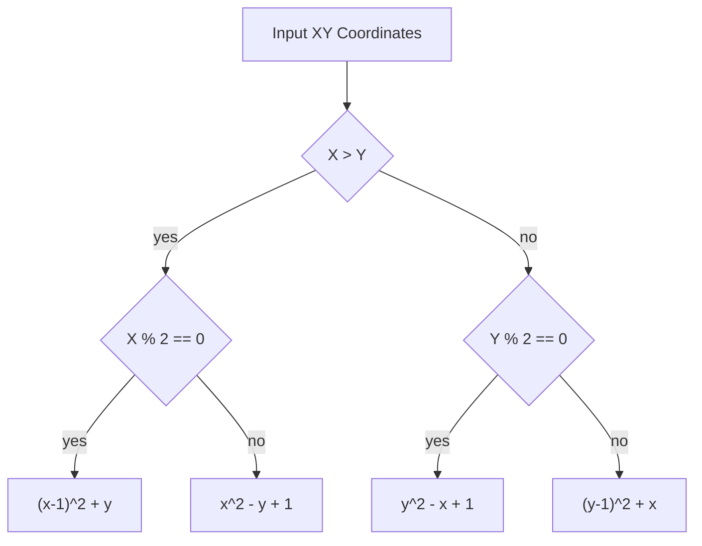

# Number Spiral

https://cses.fi/problemset/task/1071

## Algorithm

```mermaid
graph TB
    input[Input XY Coordinates]
    comparison{X > Y}
    xModulo{X % 2 == 0}
    yModulo{Y % 2 == 0}
    xDominantEven["(x-1)^2 + y"]
    xDominantOdd["x^2 - y + 1"]
    yDominantEven["y^2 - x + 1"]
    yDominantOdd["(y-1)^2 + x"]
    
    input --> comparison
    comparison --> |yes| xModulo
    comparison --> |no| yModulo
    xModulo --> |yes| xDominantEven
    xModulo --> |no| xDominantOdd
    yModulo --> |yes| yDominantEven
    yModulo --> |no| yDominantOdd
```