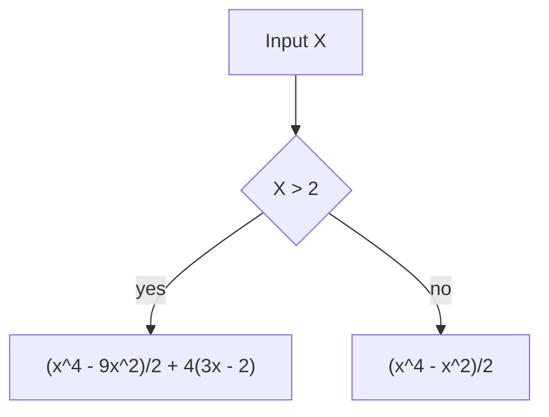

# Two Knights

https://cses.fi/problemset/task/1072

## Algorithm

```mermaid
graph TB
    input[Input X]
    comparison{X > 2}
    xBiggerThanTwo["(x^4 - 9x^2)/2 + 4(3x - 2)"]
    xSmallerThanTwo["(x^4 - x^2)/2"]
    
    input --> comparison
    comparison --> |yes| xBiggerThanTwo
    comparison --> |no| xSmallerThanTwo
```